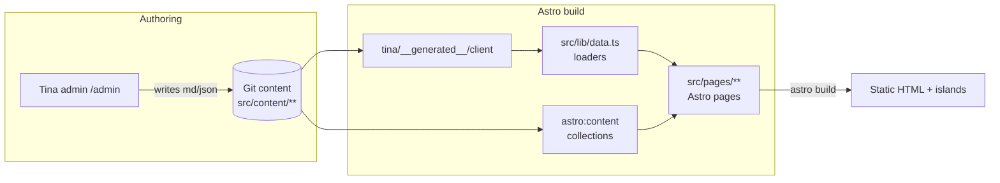

# Architecture

This document describes how the Babasarok website is structured, how content
and data flow through it at build time and runtime, and where the main
opportunities for improvement are.

> Conventions and priorities live in [AGENTS.md](../AGENTS.md). This document is
> the higher-level "how the pieces fit together" map.

## 1. Stack overview

| Concern             | Technology                                                        |
| ------------------- | ----------------------------------------------------------------- |
| Site framework      | **Astro 6** (`output: "static"`)                                  |
| Interactive islands | **Svelte 5** (runes), hydrated only where needed                  |
| Styling             | **Tailwind CSS 4** (`@theme` tokens in `src/styles/global.css`)   |
| CMS / content       | **TinaCMS** (Git-backed, Tina Cloud in prod, `--local` in dev/CI) |
| Markdown            | MDX + a custom `remark-asset-images` plugin                       |
| Images              | `astro:assets` (`sharp`), responsive `layout: "constrained"`      |
| Fonts               | `astro:assets` Google font provider (Poppins, Yeseva One)         |
| Forms               | Order configurator island → Web3Forms email submission            |
| Tests               | Vitest (unit), Playwright (hydration), dist guard scripts         |

The site is a **static, build-time-first** application. Client JavaScript is
limited to a handful of Svelte islands (most significantly the order form). This
directly reflects the core values in [AGENTS.md](../AGENTS.md): build-time & no-JS
first, standardised over bespoke, no global CSS.

## 2. High-level data flow



There are **two parallel content access paths**, which is the single most
important thing to understand about this codebase:

1. **TinaCMS path** — `src/lib/data.ts` calls the generated Tina client
   (`tina/__generated__/client`) for `config`, `product`, `material`, and
   `delivery_method` data. This is the source for the global config (header /
   footer / SEO) and the order form island.
2. **Astro content collections path** — `src/content.config.ts` defines `config`,
   `product`, `blog`, `material`, and `contact` collections via glob loaders.
   List pages and the landing grids use `getCollection(...)` so they get
   `astro:assets` `ImageMetadata` and `<Image>` optimization.

The same on-disk content (`src/content/**`) is read by **both** paths, with
different shapes and different image handling. See §5 for why and the risks.

## 3. Directory map

```
src/
  layouts/Base.astro        # <html> shell: SEO/OG meta, favicons, fonts, Header/Footer, ClientRouter
  pages/                    # Routes (all static)
    index.astro             # Landing: Hero + Service + About + Product + Blog
    contact.astro           # Order form island + contact info
    product/[...page].astro  + [id].astro   # Paginated list + detail
    material/...            # Paginated list + detail
    blog/...                # Paginated list + detail
    rss.xml.ts              # RSS feed
    site.webmanifest.ts     # PWA manifest (endpoint)
    src/                    # (Tina admin image-serving endpoint area)
  components/
    blocks/                 # Page-section components (Hero, Service, About, Product, Blog, Header, Footer)
    blocks/order/           # Order configurator Svelte island + sub-components
    ui/                     # Reusable presentational components (Button, *Card, Pagination, ...)
    MetaPixel.astro         # Meta Pixel snippet
  lib/                      # Framework-agnostic logic + data loaders
    data.ts                 # Tina loaders + image-ref resolution
    types.svelte.ts / typeHelpers.ts / cn.ts / uuid.ts / scrollSnapper.ts
    assets/                 # resolveImage() (index.ts), tinaImageUrl, remarkAssetImages
    product/                # field{Types,Value,Visibility}, materials, validation (product-config domain)
    pricing/                # price, setDiscount (imports product/)
    order/                  # basket.svelte, product, queryParams, storage, submit
    __tests__/              # Vitest specs + fixtures
  styles/                   # global.css (@theme tokens), base.css, prose.css, theme.css
  content/                  # Tina-managed md/json (the data)
tina/                       # Tina schema (collections/*.ts), config.ts, generated client
scripts/                    # test/no-tina-cloud-urls.ts
tests/                      # Playwright hydration.spec.ts
```

## 4. Key subsystems

### 4.1 Layout & SEO (`src/layouts/Base.astro`)

Single shell for every page. Pulls global config from Tina (`getConfig()`) for
title/description/OG/theme-color, emits canonical + Open Graph tags, preloads
fonts, wires favicons through the Vite asset pipeline, and includes
`ClientRouter` (view transitions), Meta Pixel, and the Web3Forms client script.

### 4.2 Content modelling (Tina + Astro collections)

- **Tina collections** (`tina/collections/*.ts`) define the editable schema:
  global config, the five landing sections (hero/service/about/product-section/
  blog-section), and the `product` / `material` / `blog` / `delivery-method` /
  `contact` content types.
- **Astro collections** (`src/content.config.ts`) re-declare a subset with Zod
  schemas, primarily so list/detail pages can use `getCollection()` +
  `<Image>`. Unused configurator frontmatter is stripped by Zod.
- **Tina is the source of truth for shape.** The Astro/Zod schema can only mirror
  what Tina stores — it never models more than the CMS can persist. Anything
  richer (stricter unions, per-variant value types) is layered on downstream, not
  pushed back into the schema.
- **CMS↔Astro type reconciliation.** `src/lib/data.ts` derives an "enhanced" TS
  type per collection from the generated Tina client, and asserts it is
  structurally identical to the Astro `InferEntrySchema<...>` via
  `RecursiveDiff` + `AssertTrue<IfEquals<XDiff, never>>()` (see
  `src/lib/typeHelpers.ts`). If the two drift, the build fails at type-check —
  hover the `XDiff` alias to see the mismatch. Loaders (`getProducts`, etc.)
  hand-map the raw Tina result into the enhanced shape, which is the one place
  nullable→undefined normalization and image optimization happen.
- **Shared value lists live in one module.** Where the same enumerated values are
  needed by the Tina schema, the Zod schema, and runtime code, they are defined
  once and imported by all three (e.g. `src/lib/product/fieldTypes.ts` feeds the
  Tina `type` select options, a Zod `z.enum`, and `data.ts`'s discriminant).
  Tina config imports these with a **relative** path — its esbuild bundling
  ignores the `@/` tsconfig alias.
- **Discriminated unions are a runtime/form-side concern.** Because Tina stores a
  flat record, the CMS/Zod type keeps a single shape with an enum tag. Where code
  needs a proper discriminated union (e.g. a per-type value shape), it is built
  by distributing over the shared tag in the app types (`src/lib/types.svelte.ts`),
  not declared in the schema.

### 4.3 Image resolution

Images are the most intricate part of the system because Tina stores references
as **paths** (`/src/assets/...` locally, or `https://assets.tina.io/.../__file/...`
in cloud builds) while Astro wants `ImageMetadata` objects from `src/assets`.

- `src/lib/assets/index.ts` `resolveImage()` normalizes both forms to a hashed
  `/_astro/...` asset.
- `src/lib/data.ts` `resolveTinaImageRefs()` deep-walks every loaded Tina entity
  and rewrites any image-looking string to the optimized local `src`. This is a
  **backstop** that prevents Tina Cloud URLs leaking into client-island props
  (rich-text `content` ASTs are the main offender).
- `src/lib/assets/remarkAssetImages.ts` does the equivalent rewrite inside the
  Markdown `<Content/>` pipeline.
- `scripts/test/no-tina-cloud-urls.ts` is a CI guard that fails the build if any
  `assets.tina.io` URL survives into `dist/`.

### 4.4 The order configurator island (`components/blocks/order/`)

The main pieces of client-side state are the product-page configurator and the
checkout. Product pages render `<ProductOrder client:load>` to build up a basket
item, and `checkout.astro` renders `<CheckoutForm client:load>` for the basket
review + submission, passing in Tina-derived `products`, `deliveryMethods`, and
`config` as plain serializable data. Domain logic is extracted into `src/lib/`:

- `priceUtils.ts` — price computation
- `materialUtils.ts` — material/color resolution (`resolveColorCount`)
- `validation.ts` — field validation
- `orderSubmit.ts` — `formatProductString` / `buildOrderFormData` / `submitOrder`
- `emailConverter.ts` — typed `OrderEmailData`

Submission posts a `FormData` payload to Web3Forms. Unit tests in
`src/lib/__tests__/` drive `submitOrder` with a stubbed `fetch` and assert the
exact email body via inline snapshots.

### 4.5 Build & tooling specifics

- `npm run dev` = `tinacms dev -c "astro dev"` (Tina backend on :4001 + Astro on
  :4321). Plain `astro dev` cannot reach Tina.
- `npm run build` talks to Tina Cloud (needs creds); `npm run build:local` is the
  self-contained, cred-free local/CI build.
- Scoped npm `overrides` pin `vite ^7` globally but `^4.5.9` for `@tinacms/cli`
  (incompatible Vite expectations). Install with `--ignore-scripts`.
- CI (`.github/workflows/pr-checks.yml`): a `static` matrix (format/lint/
  stylelint/astro-check/svelte-check), a real `build`, then `test-tina-urls`,
  `test-hydration`, and `unit` jobs reusing the `dist` artifact.

## 5. Key points for improvement

These are ordered roughly by impact. They are observations, not yet committed
work.

### 5.1 Reconcile the two content-access paths (highest leverage)

The dual Tina-client / Astro-collection access of the **same** `src/content`
files is the biggest source of accidental complexity and bug surface (it already
caused the Tina Cloud URL leaks the `resolveTinaImageRefs` walker now guards
against). Worth deciding on a single primary path, or at least documenting a hard
rule for which path each page type uses and why, and adding a schema-parity check
so Tina and Zod definitions cannot silently drift.

### 5.2 Make image resolution declarative instead of defensive

`resolveTinaImageRefs()` deep-walking entire entities and a regex-based
"looks like an image" heuristic is a defensive workaround for not knowing which
fields are images. A typed mapping (or generating the image-field list from the
Tina schema) would be more maintainable and less prone to silent misses, and
would let the CI URL guard become a true belt-and-suspenders rather than the
primary defense.

### 5.3 Type-safety gaps in `data.ts`

Several loaders carry `// eslint-disable-next-line @typescript-eslint/explicit-function-return-type`.
Deriving and exporting explicit return types (the `Cms*` types already hint at
this) would remove the disables and make the data contracts visible at a glance.

### 5.4 Build robustness

- `astro build` has historically failed on a Tailwind/rolldown `tsconfigPaths`
  error tied to the Vite version pin; keep an eye on upstream so the override can
  eventually be dropped.

### 5.5 Test coverage breadth

Strong unit coverage exists for order-string/price/validation logic, and one
hydration smoke test guards islands. Gaps worth filling: image-resolution
(`resolveImage` / `resolveTinaImageRefs`) unit tests (these are the trickiest,
most regression-prone code), and at least one end-to-end happy-path test for the
order submission.

### 5.6 Documentation & onboarding

Much of the hard-won operational knowledge currently lives only in agent/repo
memory (Vite override rationale, `--ignore-scripts`, Tina dev ports, the Plate
duplicate-dependency crash). Promoting the essentials into this repo's docs would
de-risk onboarding for humans who don't have that memory.

```

```
